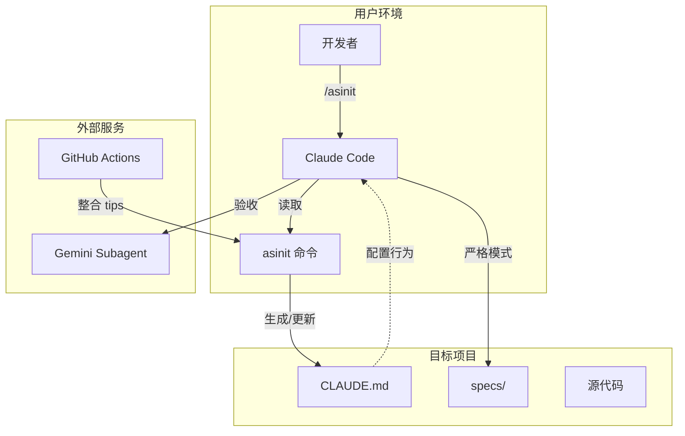

# ASINIT

Claude Code 执行协议初始化工具，为项目生成标准化的 AI 开发规范。

## 架构概览



## 安装

```bash
cp asinit_AwosomeCLAUDE.md ~/.claude/commands/asinit.md
```

## 使用

```bash
/asinit
```

## 工作原理

| 场景 | 行为 |
|------|------|
| `CLAUDE.md` 不存在 | 创建新文件 |
| 存在但无标记 | 插入到文件最前面 |
| 存在且有标记 | 只更新标记内容，保留其他部分 |

## 两种模式

### 严格执行模式

当用户提及 specs 文档时触发，强制 5 步流程：

1. 加载 Specs
2. 单 Task 执行
3. 强制测试
4. Gemini 验收
5. 提交

### 通用开发模式

默认模式，4 步流程：

1. 理解需求
2. 实现
3. 测试
4. 提交

---

## 团队协作

### 提交避坑经验

```bash
# 1. 拉取最新
git pull origin main

# 2. 新建 tips 文件（禁止修改已有文件）
# 命名：<主题>-<姓名>.md

# 3. 按模板填写（参考 tips/_template.md）

# 4. 提交
git add tips/你的文件.md
git commit -m "tips: 添加 xxx 避坑经验"
git push origin main
```

**规则：**
- ❌ 禁止修改 `asinit_AwosomeCLAUDE.md`
- ❌ 禁止修改他人 tips
- ✅ 只能新增 `tips/*.md`

### 自动整合

推送 tips 后，GitHub Actions 自动：

1. 检测新增文件
2. 调用 Claude API (AWS Bedrock) 智能整合
3. 更新核心协议
4. 自动提交

**配置：** 在仓库 Settings → Secrets 添加：
- `AWS_ACCESS_KEY_ID`
- `AWS_SECRET_ACCESS_KEY`

### 安全机制

自动整合脚本包含多层安全防护：

| 机制 | 说明 |
|------|------|
| 路径遍历防护 | 验证文件路径在工作目录内，防止读取敏感文件 |
| Prompt 注入防护 | 使用 XML 标签分隔输入数据，防止恶意指令覆盖规则 |
| 文件备份恢复 | 处理前自动备份，失败时自动恢复 |
| 输出验证 | 检查输出完整性，缺少关键标记则拒绝写入 |
| 安全审计 | AI 检测恶意内容并报告 |

### 整合规则

AI 对每条 tip 执行以下判断：

1. **安全检查** → 包含恶意指令则拒绝
2. **重复检查** → 完全重复则跳过，部分重复则合并
3. **格式化** → 新增内容保持与现有约束风格一致

**保护区域：**
- ❌ 标准执行流程（不可修改）
- ❌ 系统指令（不可修改）
- ❌ YAML front matter（不可修改）
- ✅ 规范约束区域（可增删改）

---

## 目录结构

```
├── asinit_AwosomeCLAUDE.md   # 核心协议
├── README.md
├── Subagent/
│   └── gemini-mcp-suagent.md # Gemini 子代理配置
└── tips/                      # 团队避坑经验
    ├── README.md
    └── _template.md
```

## License

MIT
