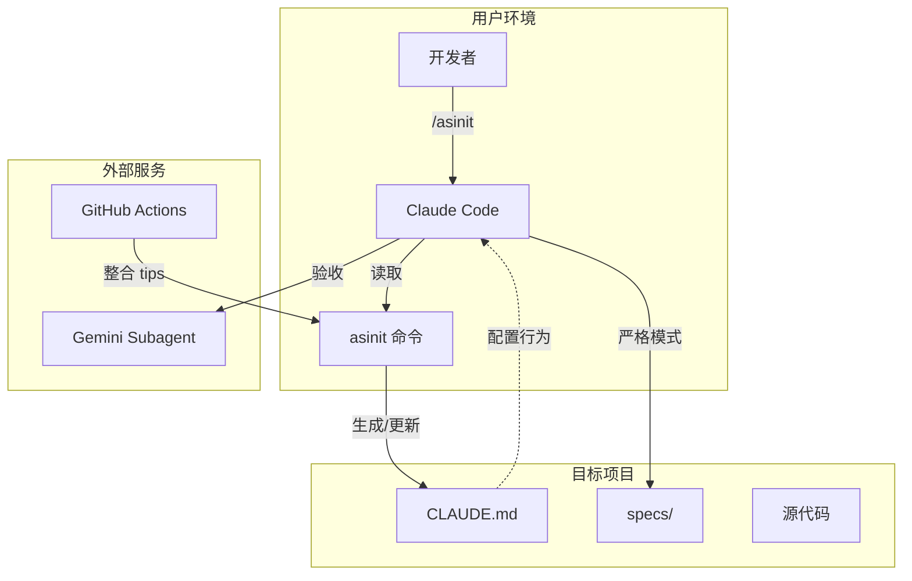

# ASINIT

Claude Code 执行协议初始化工具，为项目生成标准化的 AI 开发规范。

## 核心优势

| 特性 | 说明 |
|------|------|
| 🔄 **双模式切换** | 自动识别 specs 文档，智能切换严格/通用开发模式 |
| 🛡️ **补丁式更新** | 只更新标记区域，保留项目自定义配置 |
| 🤖 **AI 自动整合** | 团队提交 tips 后自动整合到核心协议，零人工干预 |
| 🔒 **多层安全防护** | 路径遍历防护、Prompt 注入防护、文件备份恢复 |
| 👥 **团队协作友好** | 分布式知识库，团队经验自动沉淀 |

## 快速开始

### 安装

```bash
cp asinit_AwosomeCLAUDE.md ~/.claude/commands/asinit.md
```

### 使用

```bash
/asinit
```

---

## 团队协作完整指南

### 第一步：克隆仓库

```bash
git clone https://github.com/LeonSGP43/Awesome_ClaudeMD.git
cd Awesome_ClaudeMD
```

### 第二步：提交避坑经验

```bash
# 1. 确保在最新代码上工作
git pull origin main

# 2. 创建你的 tips 文件
# 命名规范：<主题>-<姓名>.md
# 例如：typescript-null-check-zhangsan.md
touch tips/你的主题-你的名字.md

# 3. 编辑文件，按模板填写内容
```

**tips 文件模板：**

```markdown
# 主题名称

## 问题

简述你遇到的问题

## 解决方案

Claude 应该如何处理

## 示例（可选）

具体例子
```

### 第三步：提交并推送

```bash
# 只添加你的 tips 文件
git add tips/你的文件.md

# 提交（使用规范的 commit message）
git commit -m "tips: 添加 xxx 避坑经验"

# 推送到远程
git push origin main
```

### 第四步：自动整合

推送后 GitHub Actions 自动触发：

1. ✅ 检测 `tips/` 目录新增文件
2. ✅ 调用 Claude API (AWS Bedrock) 分析内容
3. ✅ 智能判断：新增 / 合并 / 跳过（重复）/ 拒绝（安全）
4. ✅ 更新 `asinit_AwosomeCLAUDE.md` 核心协议
5. ✅ 更新 `tips/README.md` 整合记录
6. ✅ 自动提交变更

### 第五步：同步最新协议

在你的项目中执行：

```bash
/asinit
```

执行时会自动：
1. 从 GitHub 下载最新版 `asinit_AwosomeCLAUDE.md`
2. 更新本地 `~/.claude/commands/asinit.md`
3. 将最新协议写入项目 `CLAUDE.md`

**离线模式**：如果网络不可用，使用本地缓存版本继续执行。

---

## 提交规则

| 规则 | 说明 |
|------|------|
| ❌ 禁止修改 | `asinit_AwosomeCLAUDE.md`（由 AI 自动维护） |
| ❌ 禁止修改 | 他人的 tips 文件 |
| ❌ 禁止修改 | `tips/README.md`（由 AI 自动更新） |
| ✅ 允许操作 | 在 `tips/` 目录下新增 `.md` 文件 |

---

## 安全机制

自动整合脚本包含多层安全防护：

| 机制 | 说明 |
|------|------|
| 路径遍历防护 | 验证文件路径在工作目录内，防止读取敏感文件 |
| Prompt 注入防护 | 使用 XML 标签分隔输入数据，防止恶意指令覆盖规则 |
| 文件备份恢复 | 处理前自动备份，失败时自动恢复 |
| 输出验证 | 检查输出完整性，缺少关键标记则拒绝写入 |
| 安全审计 | AI 检测恶意内容并报告 |

**保护区域：**
- 🔒 标准执行流程（不可修改）
- 🔒 系统指令（不可修改）
- 🔒 YAML front matter（不可修改）
- ✏️ 规范约束区域（可增删改）

---

## 两种开发模式

### 严格执行模式

当用户提及 specs 文档时触发，强制 5 步流程：

1. 加载 Specs
2. 单 Task 执行
3. 强制测试
4. Gemini 验收
5. 提交

### 通用开发模式

默认模式，4 步流程：

1. 理解需求
2. 实现
3. 测试
4. 提交

---

## 架构概览



---

## 仓库配置

在 GitHub 仓库 Settings → Secrets and variables → Actions 添加：

| Secret | 说明 |
|--------|------|
| `AWS_ACCESS_KEY_ID` | AWS 访问密钥 ID |
| `AWS_SECRET_ACCESS_KEY` | AWS 访问密钥 |

---

## 目录结构

```
├── asinit_AwosomeCLAUDE.md   # 核心协议（AI 自动维护）
├── README.md
├── .github/
│   ├── scripts/
│   │   └── integrate-tips.js # 整合脚本
│   └── workflows/
│       └── integrate-tips.yml # GitHub Actions
├── Subagent/
│   └── gemini-mcp-suagent.md # Gemini 子代理配置
└── tips/                      # 团队避坑经验
    ├── README.md              # 整合记录
    └── _template.md           # 模板
```

## License

MIT
